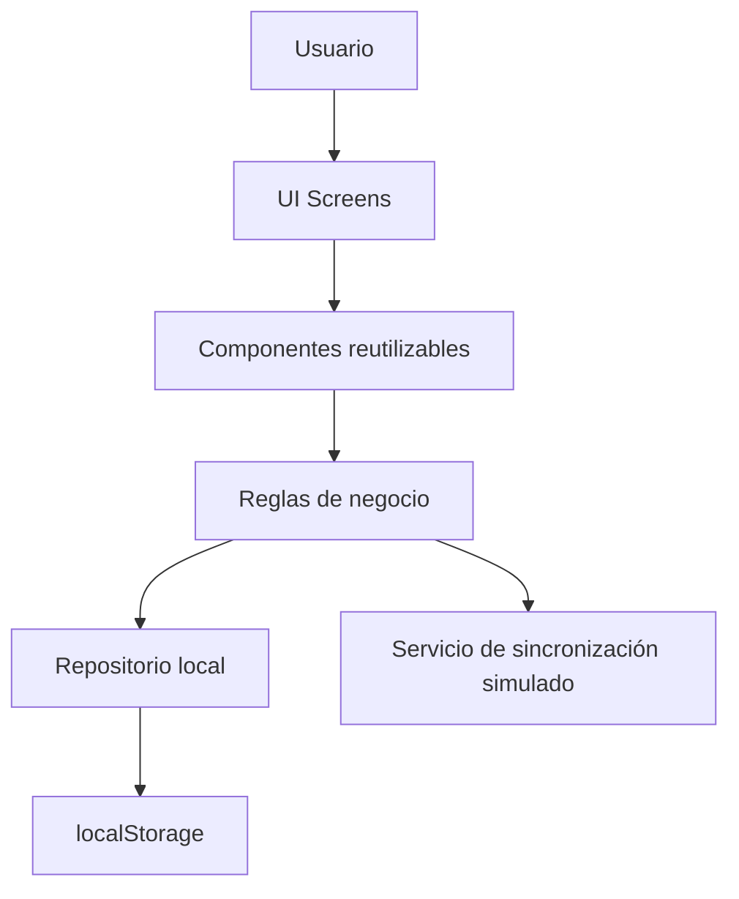
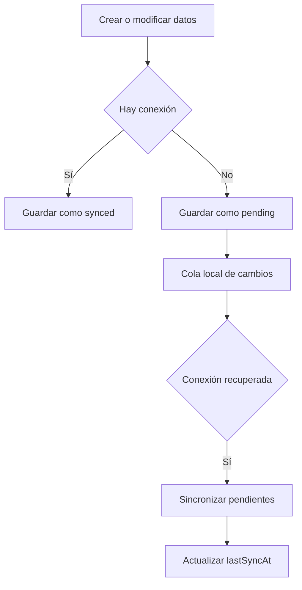

# Documento final - StockTrack Mobile Chirho

## Tabla de contenido

1. Definición del proyecto
2. Resumen ejecutivo
3. Instalación y ejecución
4. Funcionalidades principales
5. Organización del repositorio
6. Arquitectura técnica
7. Persistencia local
8. Sincronización offline
9. Funcionalidades core
10. Componentización
11. Wireframes
12. Evidencia visual
13. Conclusiones técnicas
14. Enlaces

## 1. Definición del proyecto

**Nombre:** StockTrack Mobile Chirho

**Temática:** Gestión de inventario para pequeños negocios.

**Problema a resolver:** Muchos negocios pequeños controlan inventario en hojas de cálculo o notas manuales, lo que provoca errores de stock, pérdida de historial y dificultad para detectar productos agotados. StockTrack Mobile Chirho centraliza el control de productos, entradas, salidas y alertas desde una interfaz móvil.

**Público objetivo:** Dueños, encargados de bodega, vendedores y personal operativo de tiendas pequeñas, ferreterías, bodegas o emprendimientos.

## 2. Resumen ejecutivo

StockTrack Mobile Chirho es una aplicación móvil-first para gestionar inventario de pequeños negocios. La solución permite registrar productos, controlar entradas y salidas, detectar bajo stock y trabajar sin conexión mediante persistencia local y sincronización simulada.

El proyecto resuelve el problema de llevar inventarios en hojas de cálculo, notas manuales o registros poco confiables. La app centraliza la información clave del inventario en una interfaz sencilla, reproducible y preparada para evolucionar hacia una solución productiva con backend y base de datos móvil.

## 3. Instalación y ejecución

Para ejecutar el proyecto en un entorno local se requiere tener instalado Node.js y npm.

1. Clonar el repositorio:

```bash
git clone git@github.com:edrodas7/proyecto_final_react_native_chirho.git
```

2. Entrar a la carpeta del proyecto:

```bash
cd proyecto_final_react_native_chirho
```

3. Instalar dependencias:

```bash
npm install
```

4. Ejecutar la aplicación en modo desarrollo:

```bash
npm start
```

5. Abrir la app en el navegador:

```text
http://localhost:3000
```

6. Ejecutar pruebas unitarias:

```bash
npm test -- --watchAll=false
```

7. Generar build de producción:

```bash
npm run build
```

## 4. Funcionalidades principales

- Dashboard con métricas generales del inventario.
- Lista de productos con búsqueda y filtros por categoría.
- Registro y edición de productos.
- Detalle de producto con stock, precio, SKU, categoría y descripción.
- Registro de movimientos de entrada y salida.
- Alertas de bajo stock.
- Persistencia local para conservar datos en el dispositivo.
- Sincronización offline simulada mediante estados pendientes y sincronizados.

## 5. Organización del repositorio

```text
src/
  App.js
  App.css
  inventory.js
  index.js
  index.css
public/
  index.html
README.md
```

La estructura separa la interfaz, los estilos y la lógica de inventario. `App.js` contiene las pantallas y componentes; `inventory.js` centraliza datos iniciales, persistencia y funciones reutilizables.

## 6. Arquitectura técnica



La arquitectura separa responsabilidades para facilitar mantenimiento. Las pantallas no escriben directamente lógica compleja de datos; usan funciones auxiliares como `loadInventoryStateChirho`, `saveInventoryStateChirho`, `getInventoryMetricsChirho`, `buildProductChirho` y `applyMovementChirho`.

## 7. Persistencia local

La persistencia se implementa con `localStorage`, una tecnología disponible en navegadores modernos. La app guarda un objeto con productos, movimientos y fecha de última sincronización.

Fragmento representativo:

```js
export function saveInventoryStateChirho(stateChirho) {
  window.localStorage.setItem(STORAGE_KEY_CHIRHO, JSON.stringify(stateChirho));
}
```

Esta decisión permite que el usuario cierre la aplicación y conserve los datos creados. En una versión productiva, esta capa podría migrarse a SQLite, Room, Hive o AsyncStorage, manteniendo la misma separación de responsabilidades.

## 8. Sincronización offline

La app simula conectividad con un control `Online/Offline`.

- Si la app está offline, los cambios quedan con `syncStatus: "pending"`.
- Si la app está online, los cambios pueden marcarse como sincronizados.
- El botón `Sincronizar` procesa productos y movimientos pendientes.
- La estrategia de resolución de conflictos propuesta es `last-write-wins`, usando `updatedAt`.

Flujo:



## 9. Funcionalidades core

La funcionalidad central es el control de stock mediante productos y movimientos. Cada movimiento modifica la cantidad disponible del producto.

Fragmento representativo:

```js
export function applyMovementChirho(productChirho, movementTypeChirho, quantityChirho, onlineChirho) {
  const deltaChirho = movementTypeChirho === 'entry' ? quantityChirho : -quantityChirho;
  return {
    ...productChirho,
    quantity: Math.max(productChirho.quantity + deltaChirho, 0),
    syncStatus: onlineChirho ? productChirho.syncStatus : 'pending',
    updatedAt: new Date().toISOString()
  };
}
```

## 10. Componentización

La interfaz reutiliza componentes como:

- `MetricChirho`: muestra indicadores del dashboard.
- `StatusBadgeChirho`: muestra estados de bajo stock, pendiente o disponible.
- `ProductListChirho`: renderiza productos y acciones principales.

Esta componentización evita duplicación y facilita extender la app con más pantallas.

## 11. Wireframes

Se incluyen wireframes de baja fidelidad en la carpeta `docs/wireframes/`. Estos bocetos muestran la estructura de las pantallas principales y el flujo offline:

1. `dashboard.svg`: pantalla inicial con métricas, estado de conexión y alertas de bajo stock.
2. `products.svg`: lista de productos con búsqueda, filtro y tarjetas de inventario.
3. `detail-movement.svg`: detalle de producto, formulario de movimiento e historial.
4. `product-form.svg`: formulario para crear o editar productos.
5. `offline-sync-flow.svg`: flujo donde los cambios se guardan localmente como pendientes y luego se sincronizan.

Explicación del flujo: el usuario inicia en el dashboard, revisa alertas o entra a la lista de productos. Desde la lista puede abrir el detalle de un producto, registrar entradas o salidas, o editar la información. Si necesita agregar un producto nuevo, usa el formulario. Cuando la app está offline, los cambios quedan pendientes; al volver online, se sincronizan manualmente desde el dashboard.

## 12. Evidencia visual

Agregar capturas reales de:

- App en modo offline.
- Producto con bajo stock.
- Creación de producto.
- Registro de movimiento.
- Cambio pendiente.
- Sincronización completada en modo online.

## 13. Conclusiones técnicas

StockTrack Mobile Chirho demuestra cómo construir una solución móvil organizada para controlar inventario de forma local. El mayor desafío fue modelar un flujo offline comprensible sin depender de un backend real. La solución adoptada fue guardar los cambios en el dispositivo y etiquetarlos con estados de sincronización.

Como mejora futura, se podría integrar autenticación, backend real, escaneo de códigos de barras, exportación a PDF/Excel y almacenamiento local más robusto mediante SQLite o una base de datos móvil.

## 14. Enlaces

**Repositorio GitHub:** https://github.com/edrodas7/proyecto_final_react_native_chirho

**APK descargable:** opcional, pegar enlace aquí si aplica.
