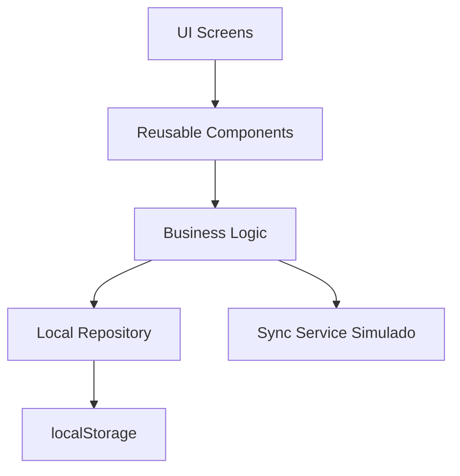

# StockTrack Mobile Chirho

Aplicación móvil-first para gestión de inventario de pequeños negocios. Permite registrar productos, controlar entradas y salidas, detectar bajo stock y simular sincronización offline.

## Funcionalidades

- Dashboard con total de productos, alertas de bajo stock, cambios pendientes y valor estimado del inventario.
- CRUD básico de productos: crear, editar, buscar y filtrar.
- Detalle de producto con stock, precio, categoría y estado.
- Registro de movimientos de entrada y salida.
- Persistencia local usando `localStorage`.
- Modo offline/online simulado con cola de cambios pendientes.
- Sincronización manual de datos pendientes cuando la app está en modo online.

## Instalación

```bash
npm install
npm start
```

La app quedará disponible normalmente en `http://localhost:3000`.

## Build

```bash
npm run build
```

## Repositorio

https://github.com/edrodas7/proyecto_final_react_native_chirho

## Estructura

```text
src/
  App.js          Pantallas, navegación y flujos principales
  App.css         Estilos mobile-first
  inventory.js    Datos iniciales, persistencia y reglas de negocio
  index.js        Entrada de React
  index.css       Estilos globales
public/
  index.html      Documento base de la app
```

## Arquitectura



La app usa una arquitectura por capas simple. La interfaz está en `App.js`, las reglas reutilizables de inventario están en `inventory.js` y la persistencia se centraliza en funciones de lectura/escritura local con sufijo `Chirho`.

## Persistencia local

Los productos y movimientos se almacenan en `localStorage` con la llave `stocktrack-mobile-chirho-state-v1`. Esto permite cerrar y abrir el navegador manteniendo los datos del inventario.

## Sincronización offline

La aplicación incluye un switch `Online/Offline` para simular conectividad:

- En modo offline, los cambios se guardan localmente con `syncStatus: "pending"`.
- En modo online, el botón `Sincronizar` marca productos y movimientos pendientes como `synced`.
- La estrategia de conflicto propuesta es `last-write-wins`, usando `updatedAt` como referencia.

## Modelo de datos

```js
Product = {
  id,
  name,
  sku,
  category,
  quantity,
  minStock,
  price,
  description,
  syncStatus,
  updatedAt
}

Movement = {
  id,
  productId,
  type,
  quantity,
  reason,
  createdAt,
  syncStatus
}
```

## Evidencia recomendada para entrega

Toma capturas de:

1. Dashboard con métricas y estado offline.
2. Lista de productos con búsqueda/filtro.
3. Detalle de producto.
4. Formulario de nuevo producto.
5. Movimiento registrado.
6. Cambio pendiente y luego sincronizado.

## Wireframes

Los wireframes están en `docs/wireframes/`:

- `dashboard.svg`
- `products.svg`
- `detail-movement.svg`
- `product-form.svg`
- `offline-sync-flow.svg`
